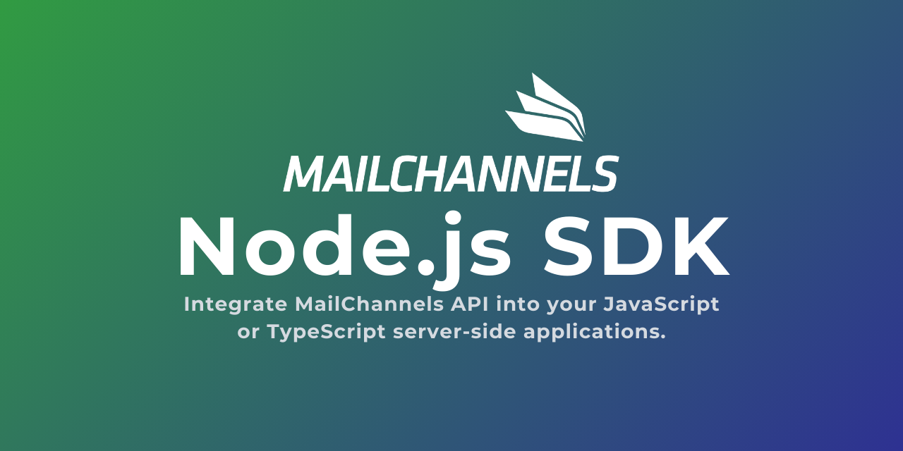

# MailChannels Node.js SDK

[![npm version][npm-version-src]][npm-version-href]
[![npm downloads][npm-downloads-src]][npm-downloads-href]
[![Build Status][build-status-src]][build-status-href]
[![License][license-src]][license-href]
[![TypeScript][typescript-src]][typescript-href]
[![Node.js][node-src]][node-href]

> Built and tested against Email API `0.21.1`

Node.js SDK to integrate [MailChannels Email API](https://docs.mailchannels.net/email-api) into your JavaScript or TypeScript server-side applications.

<!-- #region overview -->
This library provides a simple way to interact with the [MailChannels Email API](https://docs.mailchannels.net/email-api). It is written in TypeScript and can be used in both JavaScript and TypeScript projects and in different runtimes.
<!-- #endregion overview -->

- [✨ Release Notes](CHANGELOG.md)
- [📖 Documentation](https://mailchannels.yizack.com)

## Contents

- 🚀 [Features](#features)
- 📏 [Prerequisites](#prerequisites)
- 📦 [Installation](#installation)
- 📚 [Usage](#usage)
- 📐 [Naming Conventions](#naming-conventions)
- 🧪 [Local simulator](#local-simulator)
- ⚖️ [License](#license)
- 💻 [Development](#development)

## <a name="features">🚀 Features</a>

<!-- #region features -->
This SDK fully supports all features and operations available in the [MailChannels Email API](https://docs.mailchannels.net/email-api). It is actively maintained to ensure compatibility and to quickly add support for new API features as they are released.

Some of the things you can do with the SDK:

- Send transactional emails
- Check DKIM, SPF & Domain Lockdown
- Configure DKIM keys
- Webhook notifications
- Manage sub-accounts
- Retrieve metrics
- Inspect webhook delivery batches
- Handle suppressions
- Run a local simulator for development testing

> [!TIP]
> For a detailed reference mapping each SDK method to its corresponding MailChannels API endpoint reference, see the [SDK-API Mapping](https://mailchannels.yizack.com/sdk-api-mapping)
<!-- #endregion features -->

## <a name="prerequisites">📏 Prerequisites</a>

- [Create a MailChannels account](https://www.mailchannels.com/pricing/#for_devs)
- [Create an API key](https://console.mailchannels.net/settings/accountSettings#APIKeys)

## <a name="installation">📦 Installation</a>

Add `mailchannels-sdk` dependency to your project

```sh
# npm
npm i mailchannels-sdk

# yarn
yarn add mailchannels-sdk

# pnpm
pnpm add mailchannels-sdk
```

## <a name="usage">📚 Usage</a>

To authenticate, you'll need an API key. You can create and manage API keys in **Dashboard** > **Account Settings** > **API Keys**.

Pass your API key while initializing a new MailChannels client.

```ts
import { MailChannels } from 'mailchannels-sdk'

const mailchannels = new MailChannels('your-api-key')
```

Send an email:

```ts
const { data, error } = await mailchannels.emails.send({
  from: 'Name <from@example.com>',
  to: 'to@example.com',
  subject: 'Test email',
  html: '<p>Hello World</p>'
})
```

## <a name="naming-conventions">📐 Naming Conventions</a>

<!-- #region naming-conventions -->
Most properties in the MailChannels API use `snake_case`. To follow JavaScript conventions, the SDK adopts `camelCase` for all properties. This means:

- Most options and responses match the API docs, but field names are `camelCase` rather than `snake_case`.
- Some fields are grouped into nested objects or renamed for simplicity and better developer experience.
- While most fields match the API docs (just with `camelCase`), a few may be simplified or reorganized to feel more natural for JavaScript developers.
<!-- #endregion naming-conventions -->

## <a name="local-simulator">🧪 Local simulator</a>

<!-- #region simulator -->
This package includes a local MailChannels simulator you can run via the CLI. It holds state in memory and emulates the SDK-supported endpoints, letting you develop and test your application locally without hitting the real MailChannels service.

| API         | Source                                                                                                         |
| ----------- | -------------------------------------------------------------------------------------------------------------- |
| Email API   | [`src/simulator/email-api.mjs`](https://bitbucket.org/mailchannels/mailchannels-email-api-sdk-js/src/main/src/simulator/email-api.mjs)  |

> [!IMPORTANT]
> The simulator approximates the MailChannels service for local development and testing. It is not a production implementation and may differ from the live service.

### Start the simulator

```sh
# default: http://127.0.0.1:8787
npx mailchannels-sdk simulate
```

### Options

| Option            | Description             | Default     |
| ----------------- | ----------------------- | ----------- |
| `--port <number>` | Port to listen on       | `8787`      |
| `--host <host>`   | Host address            | `127.0.0.1` |
| `--silent`        | Suppress simulator logs | `false`     |

You can override the bind address with the `--host` and `--port` options:

```sh
npx mailchannels-sdk simulate --host 127.0.0.1 --port 8787
```

Disable logs with the `--silent` option:

```sh
npx mailchannels-sdk simulate --silent
```

### Point the SDK at the simulator

Use the optional `baseUrl` constructor option when creating the client:

```ts
import { MailChannels } from 'mailchannels-sdk'

const mailchannels = new MailChannels('local-test-key', {
  baseUrl: 'http://127.0.0.1:8787'
})

const { data, error } = await mailchannels.emails.send({
  from: 'sender@example.com',
  to: 'recipient@example.com',
  subject: 'Hello from the simulator',
  html: '<p>Local test</p>'
})
```

### What the simulator supports today

- Email sends and async sends
- Domain checks
- DKIM key create, list, rotate, and update
- Webhook enrollment, listing, validation, signing key lookup, and batch inspection
- Sub-account lifecycle, API keys, SMTP passwords, limits, and usage
- Engagement, performance, recipient behaviour, sender, volume, and usage metrics
- Suppression create, list, and delete

### Current limitations

- State is in-memory only and is reset when the process stops
- Any non-empty `X-API-Key` is accepted, with separate in-memory state per API key
- Webhook responses are simulated locally, but the simulator does not yet emit real webhook callbacks to your application

The next planned expansion is outbound webhook delivery so client applications can test webhook ingestion flows against the simulator as well.
<!-- #endregion simulator -->

## <a name="license">⚖️ License</a>

[MIT License](LICENSE)

## <a name="development">💻 Development</a>

<details>
  <summary>Local development</summary>

```sh
# Install dependencies
pnpm install

# Build the package
pnpm build

# Run Oxlint
pnpm lint

# Run Vitest
pnpm test
pnpm test:watch

# Run typecheck
pnpm test:types

# Refresh API parity fixtures
pnpm parity:fixtures

# Run the local simulator
pnpm simulate

# Run a playground script
pnpx jiti playground/emails/send.ts

# Release new version
pnpm release
```

</details>

<!-- Badges -->
[npm-version-src]: https://img.shields.io/npm/v/mailchannels-sdk.svg?style=flat&colorA=070a30&colorB=35a047
[npm-version-href]: https://npmjs.com/package/mailchannels-sdk

[npm-downloads-src]: https://img.shields.io/npm/dm/mailchannels-sdk.svg?style=flat&colorA=070a30&colorB=35a047
[npm-downloads-href]: https://npmjs.com/package/mailchannels-sdk

[build-status-src]: https://img.shields.io/bitbucket/pipelines/mailchannels/mailchannels-email-api-sdk-js/main.svg?style=flat&colorA=070a30
[build-status-href]: https://bitbucket.org/mailchannels/mailchannels-email-api-sdk-js/pipelines

[license-src]: https://img.shields.io/npm/l/mailchannels-sdk.svg?style=flat&colorA=070a30&colorB=35a047
[license-href]: ./LICENSE

[typescript-src]: https://img.shields.io/badge/TypeScript-supported-35a047?style=flat&colorA=070a30
[typescript-href]: https://www.typescriptlang.org

[node-src]: https://img.shields.io/node/v/mailchannels-sdk.svg?style=flat&colorA=070a30&colorB=35a047
[node-href]: ./package.json
